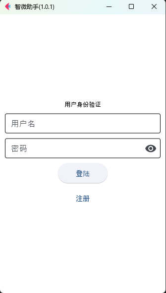
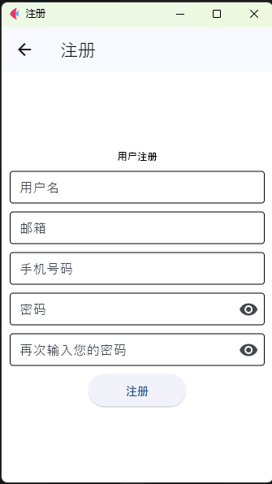
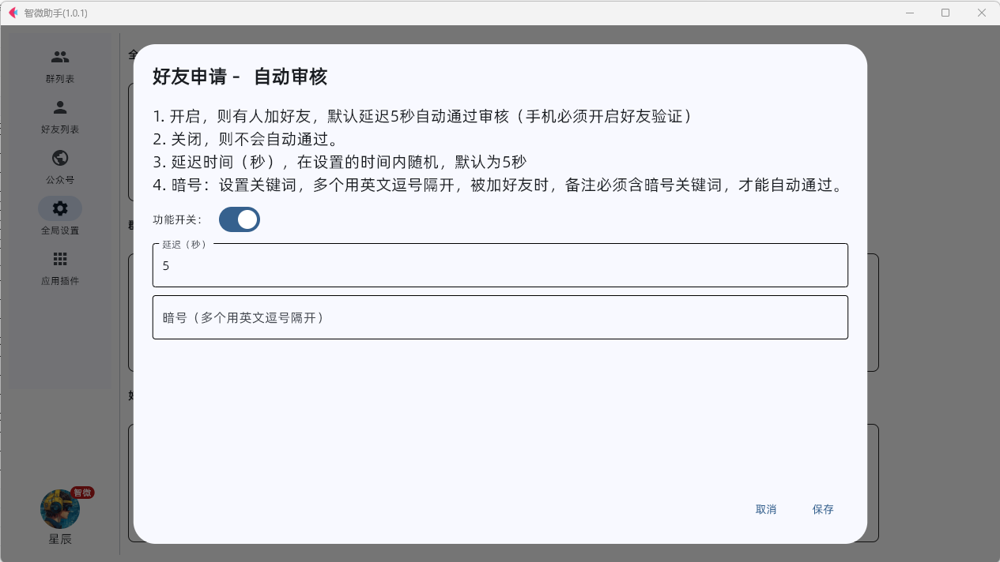

微信机器人项目(效果图持续在更新，具体以实际运行为主)

# 已实现功能列表
- 进群欢迎（群自定义）
- 退群提醒（群自定义）
- 好友欢迎语
- 好友审核（暗号）
- 邀请自动进群
- 功能插件扩展（已实现新闻功能、点歌功能等等）
- 等待开发更多全局设置，群设置
- ...

# 使用前提
## 微信版本 3.9.10.11
## python版本 3.9.11.*

# 登陆界面

# 注册界面

# 群列表

# 好友列表

# 好友审核功能

# 全局设置

# 应用插件

